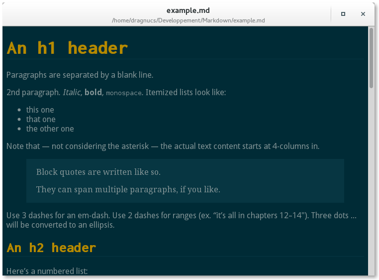

DragncusMD
==========

A simple GTK+3/Gnome3 tool to preview Markdown formated documents.

Screenshot
----------

Features
--------
- code-friendly
- cuddled-lists
- fenced-code-blocks
- footnotes
- header-ids
- metadata
- pyshell
- smarty-pants
- wiki-tables
- xml
- tag-friendly

Usage
-----

There is no install at the moment, but usage is very simple:

    python markdown.py -f /path/to/file.md

Python3 also works:

    python3 markdown.py -f /path/to/file.md

You can also make it executable `chmod +x markdown.py` and run it:

    ./markdown.py -f /path/to/file.md

Dependencies
------------

- [python3-markdown2](https://github.com/trentm/python-markdown2)
 * Available in most officials distributions repositories.

License
-------

> This program is free software: you can redistribute it and/or modify
> it under the terms of the GNU General Public License as published by
> the Free Software Foundation, either version 3 of the License, or
> (at your option) any later version.
>
> This program is distributed in the hope that it will be useful,
> but WITHOUT ANY WARRANTY; without even the implied warranty of
> MERCHANTABILITY or FITNESS FOR A PARTICULAR PURPOSE.  See the
> GNU General Public License for more details.
>
> You should have received a copy of the GNU General Public License
> along with this program.  If not, see <http://www.gnu.org/licenses/>.
